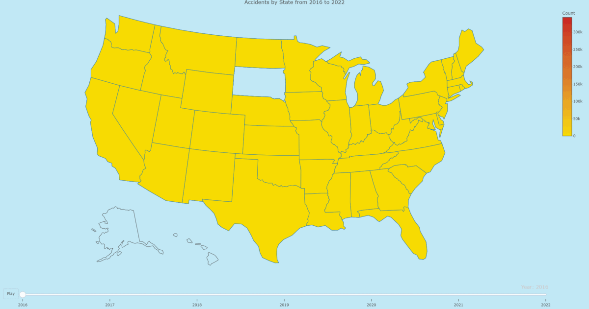
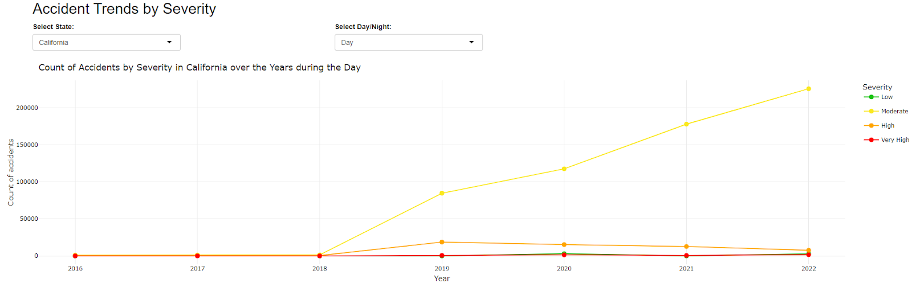
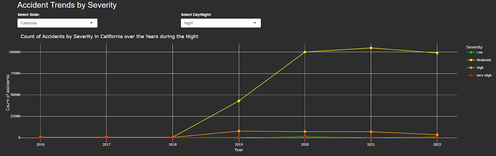
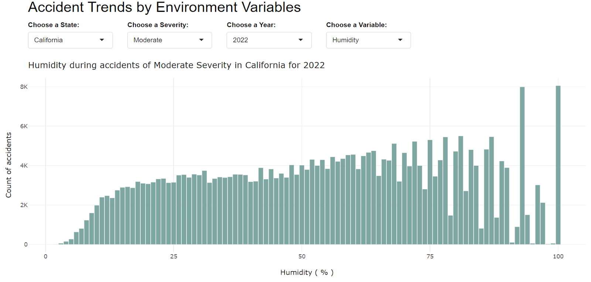
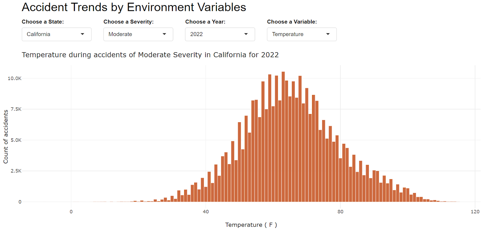
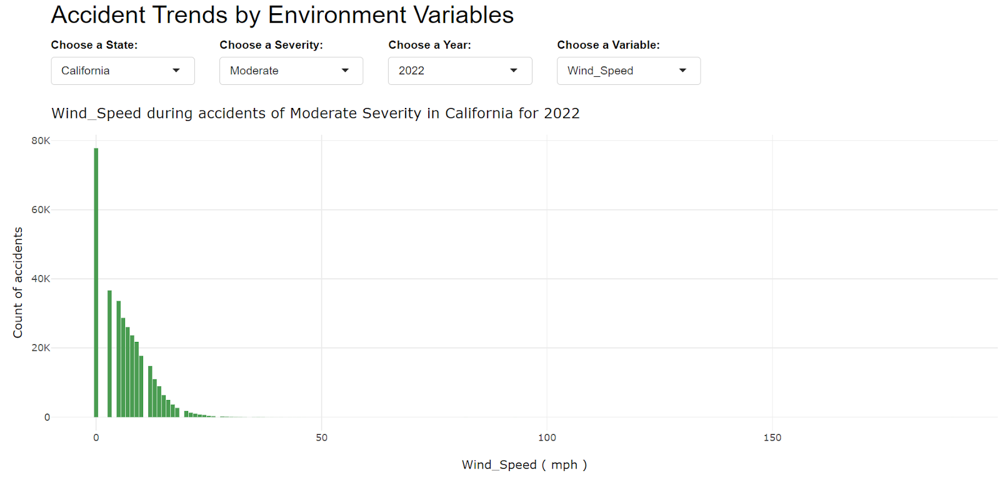

# Car crash Analysis and Visualization

This project used a dataset of [US Accidents from 2016 and 2023](https://www.kaggle.com/datasets/sobhanmoosavi/us-accidents) to analyze variables in car crashes to create consciousness. It was ellaborated in `R`.

## Visualizations

The dataset had diverse variables. The ones that provided valuable informations were chosen to achive diverse visualization that facilitated their comprehension.

### Map

This visualization shows the quantity of car crashes by state from 2016 to 2022.

Diverse information can be infered from the visualization. Such as, that California and Florida are the states with the most car crashes.

### Severity

For this variable, an interactive visualization was created, which allows the user to choose the state and between `Day` or `Night`.

From the visualizaion, it can be infered that the majority of car crashes are of moderate severity.

This visualization shows the same tendency of the majority of car crashes being moderate. However, when both visualizations are compared, it is noticitable that more accident occur during the day.

### Environmental Variables

The dataset provided diverse variables related to the environment:
- Temperature
- Wind Chill
- Humidity
- Pressure
- Visibility
- Wind Speed
- Precipitation

Hence, an interactive visualization was created to be able to choose the environmental variable, the state, the year and the severity of the car crash. This visualization allows the user to be creative and explore those variables of interest.

## Credits

- [Angie Solís](https://github.com/AngieS23)
- [Emilia Víquez](https://github.com/EmiliaViq)